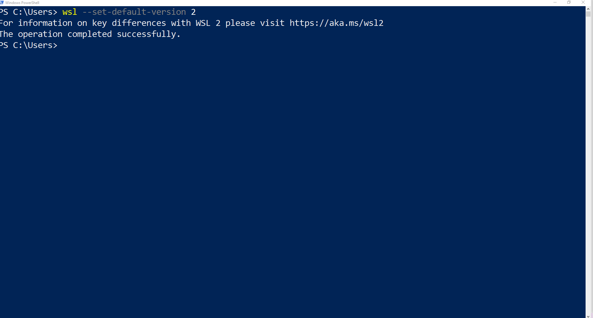

# Docker Desktop Preinstallation Tasks
This topic describes the system requirements and prerequisites required to install Docker Desktop on Windows.
## System Requirements
Before installing the Docker Desktop application, your system must meet the following hardware and software requirements:
- **RAM**: 4GB or above
- **Processor**: 64-bit processor with [Second Level Address Translation (SLAT)](https://en.wikipedia.org/wiki/Second_Level_Address_Translation)
- **Operating System (OS)**
  - Windows 11 (64-bit): Home or Pro version 21H2 or higher, or Enterprise or Education version 21H2 or higher.
  - Windows 10 64-bit: Home or Pro 2004 (build 19041) or higher, or Enterprise or Education 1909 (build 18363) or higher.
- **Additional Configuration**: You must setup the following components:
  - [Enable Virtualization support at BIOS level](#setup-enable-virtualization-at-bios-level)
  - [Enable Virtualization and Windows Subsystem for Linux (WSL) on Windows](#setup-enable-virtualization-and-wsl-features-on-windows)
  - [Install WSL 2 on Windows](#setup-install-wsl-2-on-windows-operating-system)

## Setup: Enable Virtualization at BIOS level
This section explains the steps required to enable Virtualization feature at BIOS-level.
> **Tip**: Before installation, you can perform the [steps to check](#check-bios-virtualizatio-enablement-on-your-system) if you already have Virtualization feature enabled on your system.

> **Note**: The steps explained are based on HP laptop. Some of the steps may vary based on the system brand used.

1. Turn on the computer, and then press f10 on your keyboard.
2. Use the arrow keys to select the **Configuration** tab, and then select **Virtualization Technology**.
3. Choose **Enable**.
4. Press f10 on keyboard to save the settings.

## Setup: Enable Virtualization and WSL Features on Windows
This section explains the steps required to enable Virtualization and WSL feature on Windows.
> **Note**: You must have Windows administrator permissions.  <br/>
1. Open **Control Panel**.
2. Search "Turn Windows feature on or off." The **Windows Feature** pop-up window is displayed.
3. Select **Virtual Machine Platform** and select **Windows Subsystem for Linux**.
4. Click **OK**.

## Setup: Install WSL 2 on Windows
This section explains the steps required to install WSL 2 on Windows
> **Tip**: Before installation, you can perform the [steps to check](#check-wsl-2-enablement-on-your-system) if you already have WSL2 enabled on your system.  <br/>

> **Before you Begin**: You must enable [Windows Subsystem for Linux](https://docs.microsoft.com/en-us/windows/wsl/install-manual#step-1---enable-the-windows-subsystem-for-linux) and [Check requirements for running WSL 2](https://docs.microsoft.com/en-us/windows/wsl/install-manual#step-2---check-requirements-for-running-wsl-2) on your system. Also you must have administrator permissions.  <br/>
1. Download the [Linix Kernel Update](https://wslstorestorage.blob.core.windows.net/wslblob/wsl_update_x64.msi) package. The Windows Installer Package is downloaded. 
2. Double-click the package and follow the instructions.
3. Click **Finish**. The WSL 2 package is installed on the system.
4. Press the Windows key on your keyboard and type "Windows PowerShell" in the search field.
5. Type or copy/paste the following command
    ```
    wsl --set-default-version 2
    ```
  **Result**: The message, "The operation is completed successfully," is displayed.
  

### Check WSL 2 Enablement on your System
1. Press the Windows key on your keyboard.
2. In the search box, type "Windows PowerShell."
3. Type or copy/paste the following command
    ```
    wsl --status
    ```
**Result**: If WSL 2 is enabled, then `Default Version: 2` is displayed.

### Check BIOS Virtualization Enablement on your System
1. Press `Ctrl + Alt + Delete` keys on your keyboard. The Task Manager pop-up window is displayed.
2. Go to the **Performance** tab.
3. Check if Virtualization field is enabled. The system should display `Virtualization: Enabled`.

> **Next Page**: [Installation](./Installation.md)
